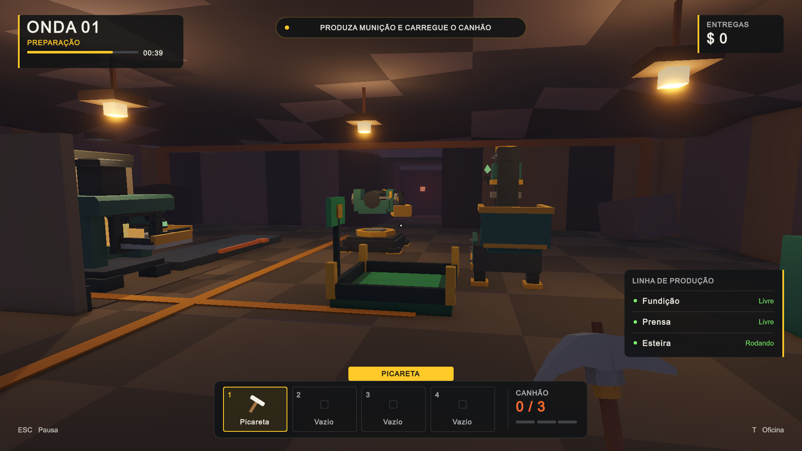

# HUD do Paper integrada ao protótipo

Referência: [Factory Chaos — In-Game HUD](https://app.paper.design/file/01M3NA5BQQSP5DTZGFR6FY5DYN/p-1-0).
Os valores de cor, dimensões e hierarquia vieram dos estilos/JSX do Paper. A imagem e o mockup são referências visuais, não especificações de gameplay.

Esta é a auditoria da integração inicial. O [refinamento posterior](refinement.md) compactou a HUD, acrescentou feedback e abriu preferências reais; os controles atuais estão no README.

## Auditoria do conceito

| Elemento do mockup | Decisão no jogo | Motivo / fonte real |
| --- | --- | --- |
| Onda 01, preparação e timer | Integrado | `WaveDirector.Current`, `SecondsLeft` e duração configurada; sem onda 2 fictícia. |
| Barra de preparação e 64% | Adaptado | A barra mostra o tempo **restante** real; removido o percentual redundante. |
| Setor C-17 | Removido | Não existe sistema de setores ou localização com esse identificador. |
| Objetivo “arme as defesas” | Adaptado | Produzir/carregar/operar o canhão, vitória ou derrota conforme a fase e a munição. Construção não existe. |
| Minério 1.284 | Substituído | Recursos são objetos físicos nos três bolsos; não existe um estoque global de minério. O canto superior mostra o dinheiro real de `DeliveryZone.Money`. |
| Energia 87% | Removido | O gerador no cenário é visual; não há sistema de energia nesta fase. |
| Operador, integridade 94, estável | Removido | Não existe vida/dano do jogador. A condição de derrota é o inimigo chegar à fábrica. |
| Picareta T2, durabilidade 76% | Removido | Não existem níveis, desgaste ou reparo. A picareta continua no slot 1 e mostra progresso somente ao minerar. |
| “Rede da fábrica”, 3/4 online | Adaptado | “Linha de produção” reúne apenas equipamentos existentes e ativos. Sem simular rede elétrica, conectividade ou máquina ausente. |
| Fundição 18/min | Substituído | Livre/fundindo, obtido de `OreMachine.IsProcessing`. Tempo e progresso aparecem ao mirar na máquina. A taxa inventada não representa a produção efetiva. |
| Munição 42 un | Substituído | A prensa mostra livre/produzindo/saída bloqueada. Fila e tempo aparecem ao mirar; objetos soltos no mundo não viram um estoque global. |
| Canhão Leste, recarga | Adaptado | O único canhão informa `Rounds / Capacity`. O carregamento continua consumindo um cartucho físico; no refinamento, M2 passou a depositar o cartucho da mão. Não existe recarga abstrata a partir de um estoque. |
| Mira grande e “E inspecionar máquina” | Adaptado | Ponto pequeno em repouso, marcas ao interagir/operar o canhão. Só aparecem comandos que existem: pegar, soltar, minerar, depositar, operar. Máquinas fornecem informação passiva ao mirar. |
| Modo construção B | Removido | Não há posicionamento de construções. A aba amarela identifica o item selecionado. |
| Parede, esteira, torre MK-I, gerador, reparo e custos | Substituído | Picareta + três slots reais, teclas 1–4. Mantidos materiais, bordas, destaque e silhuetas, sem vender mecânicas futuras. |
| Munição 24/80 | Adaptado | Munição do canhão, inicialmente 0/3 e vinculada à capacidade configurada. Ao operar, substitui os slots por instruções de tiro/saída. |
| Engrenagem de configurações | Substituído | Dica ESC para o menu de pausa. No refinamento, configurações passou a oferecer preferências reais de áudio, mouse e HUD. No canhão, ESC significa sair, não pausar. |
| Cenário desenhado no Paper | Não importado | A HUD é sobreposta ao mundo 3D real. O fundo ilustrativo do mockup não virou uma camada que cobre o jogo. |
| Esteira emperrada | Integrado ao painel | Estado e contagem regressiva reais; texto informa que ela retoma automaticamente. O aviso antigo não duplica o novo. |

## Implementação

- `Assets/Scripts/FactoryHud.cs`: apresentação IMGUI, seguindo a infraestrutura existente; escala pela área segura com referência 1600×900. Paleta exata do Paper, painéis arredondados, slots com nome e silhueta, mira e ajuda contextual. Usa a fonte embarcada do Unity em vez de depender de fontes do Windows.
- `AmmoMachine`, `ConveyorBelt` e `WaveDirector`: propriedades de leitura para dados que já existem na simulação. A HUD não muda receitas, tempos, custos, dano, capacidade nem comportamento da onda.
- `PlayerLoadout.FindMachineInput`: resolução compartilhada entre depósito e HUD. A busca pela raiz inteira confundia estações agrupadas na oficina; agora procura o componente da entrada na estação atingida.
- `RoomSwitch` e `ConveyorBelt`: mantêm seus avisos antigos como fallback, mas não os desenham por cima da HUD centralizada. Os bloqueios de pausa preexistentes foram preservados.

Informação não disponível na cena é ocultada. Nenhuma etiqueta permanente promete energia, construção, saúde, upgrade, multiplayer ou próxima onda.

## Verificação

Unity 6000.6.3f1 compilou sem erros. `Tools/VerifyFactoryHud.cs`, fora de `Assets`, executa 26 verificações sobre componentes reais em uma sessão descartável de Play: alcance e coleta, três tipos de item, inventário cheio, seleção, resolução das máquinas, timer, produção da fornalha, fila/bloqueio/recuperação da prensa, travamento/recuperação da esteira, capacidade e disparo do canhão, transições da onda, dano, vitória, derrota e pausa/retorno.

Executar pelo MCP Unity: `run_script` com `file: "Tools/VerifyFactoryHud.cs"`, `entry: "VerifyFactoryHud.Run"`, `timeout_ms: 30000`, após iniciar uma sessão nova em `SampleScene`. O teste altera somente o estado temporário da partida; sair do Play ao terminar. A automação chama também métodos internos para preparar cenários determinísticos, portanto não substitui um playtest humano completo dos controles.

Revisão visual em 1920×1080 e 1366×768: HUD normal, inventário ocupado, operação do canhão e pausa sem sobreposição. Verificados também carregamento da `IndoorFactory` (sem onda fictícia) e reinício pelo menu, com uma única HUD/menu e inventário zerado.

Limites da integração inicial: não foi produzido um novo executável nem feito teste de controle/gamepad. A fonte embarcada é uma adaptação do layout, não uma cópia tipográfica exata do Paper. Os avisos de velocidade em itens cinemáticos encontrados naquela rodada foram corrigidos no refinamento posterior.
