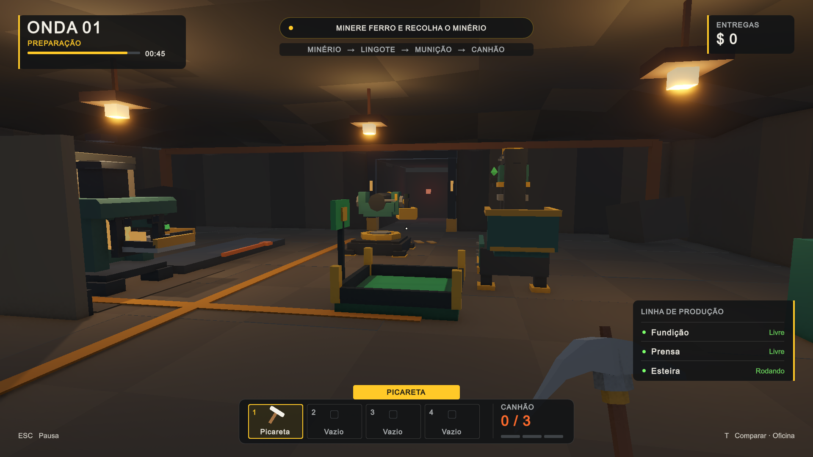
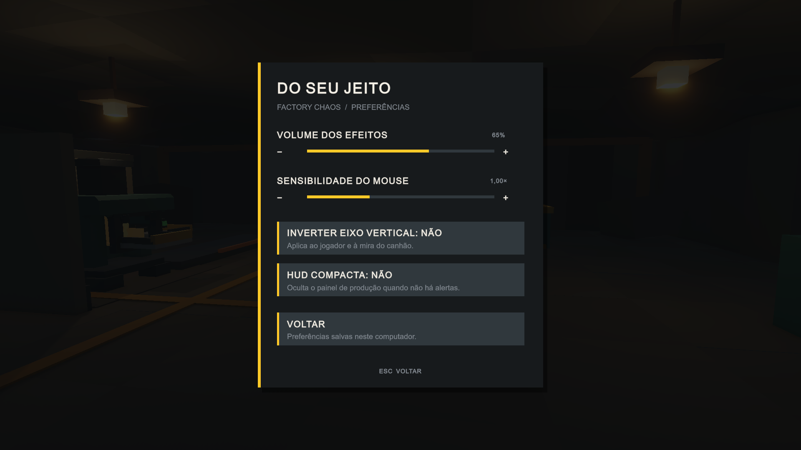

# Refinamento do corte jogável

Rodada de 29/09/2026, Unity 6000.6.3f1. O pedido de “80%” foi tratado como direção de qualidade, não como um percentual mensurável. O trabalho incrementa o protótipo existente; não recomeça o jogo nem abre novas fases.

## O que muda ao jogar

- Movimento com aceleração e desaceleração curtas. Pulo com tolerância de 100 ms ao sair de uma borda e buffer de 100 ms antes de pousar; bater no teto interrompe a subida. Sem balanço forçado da câmera, motion blur ou stamina inventada.
- Clique curto completa uma picaretada; segurar repete. O ciclo padrão passou de 1,15 s para 0,8 s. Trocar de ferramenta, operar o canhão ou pausar ainda cancela a ação.
- Teclas 1–4 e roda do mouse selecionam a picareta e os três bolsos. Coletar para um bolso vazio já selecionado coloca o objeto na mão imediatamente.
- M2 deposita minério na fornalha, lingote na prensa, cartucho no canhão e lingote na entrega. Cada ação consome o objeto físico correto; soltar objetos nas entradas continua funcionando.
- O item na mão não bloqueia mais o raycast do depósito. A HUD e a ação usam o mesmo alvo. Materiais incompatíveis, máquina ocupada e canhão cheio explicam por que a ação não está disponível.
- Coleta não atravessa paredes. A saída do canhão não reutiliza o mesmo E para coletar outro item. Reequipar um item cinemático não tenta zerar sua velocidade.
- Fornalha aguarda quando há outro item na saída, sem perder o produto concluído. A prensa reconhece um bloqueio mesmo quando o obstáculo compartilha a raiz da fábrica.
- Estados de lâmpadas e dano usam `MaterialPropertyBlock`, sem clonar/destruir o material que o renderer ainda usa. Corrigida a aparência inválida do inimigo após `Awake`/`Configure`.
- Canhão com recuperação de 0,28 s, recuo de tubo mais perceptível, clarão breve e som. A varredura do projétil respeita os mesmos colliders ignorados que a colisão física. Acertos produzem marcador e fragmentos sem colliders.
- Inimigo com braços, pernas, placas de ombro, caminhada e queda curta. Vida, velocidade, dano e condição de derrota continuam os mesmos.
- Piso e rocha com menos contraste repetitivo, ambiente com preenchimento mais legível, moldura do túnel e marcação do limite de invasão. Nenhuma máquina foi reposicionada.
- HUD inferior mais compacta, objetivo contextual, cadeia produtiva resumida, contagem dos ciclos, transição curta da seleção e mira, avisos de ações concluídas e cartão de resultado.
- Oito sons procedurais curtos para ações/estados, gerados uma vez por cena e descartados com ela. São feedback funcional, não uma trilha ou sound design final.
- Menu com continuar, controles, configurações e confirmação de reinício. T abre confirmação de comparação entre cenas, deixando explícito que a troca descarta o estado da partida.
- Preferências locais: volume dos efeitos, sensibilidade (jogador e canhão), inversão vertical e HUD compacta. Esta última oculta o painel de produção em estado normal, mas mantém alertas. As preferências são salvas ao sair das configurações/retomar. Perda de foco pausa automaticamente no executável; no Editor, isso fica desativado para não interferir com ferramentas.

## Estabilidade de cenas e renderização

O teste de ida/volta entre cenas revelou erros nativos `BatchDrawCommand` com IDs inválidos de malha/material enquanto o GPU Resident Drawer estava ativo. `Assets/Settings/PC_RPAsset.asset` passou de `m_GPUResidentDrawerMode: 1` para `0`; a repetição do fluxo ficou sem esses erros. É uma escolha de compatibilidade observada nesta máquina, **não uma medição de ganho de FPS**. Reavaliar em profiling antes de reativar. A [documentação oficial do GPU Resident Drawer](https://docs.unity.com/en-us/engine/6000.5/manual/analysis/graphics-performance-profiling/in-urp/reduce-draw-calls-urp/reduce-rendering-work-on-cpu/gpu-resident-drawer) descreve o recurso e as condições de uso/fallback; ela não confirma a causa específica do erro deste projeto.

`IndoorGroup` agora tem arquivo e GUID próprios. As cinco referências da `IndoorFactory` apontam para esse asset, preservando os IDs dos grupos e todos os objetos da cena. Isso eliminou os avisos de script ausente ao carregar a oficina. Não foi reconstruída nem salva por cima a cena inteira.

## Verificação

Scripts de teste ficam em `Tools`, fora de `Assets`, e não entram no jogo. Executar cada um pelo MCP Unity `run_script` em **uma sessão nova de Play em SampleScene**, com `timeout_ms: 30000`. Sair do Play ao terminar: eles preparam cenários descartáveis, movem objetos e chamam métodos internos.

| Script / entrada | Resultado |
| --- | --- |
| `VerifyFactoryHud.cs` / `VerifyFactoryHud.Run` | 26 verificações de regressão: inventário, produção, bloqueio, esteira, canhão, onda, vitória/derrota e pausa. |
| `VerifyRefinement.cs` / `VerifyRefinement.Run` | 38 verificações novas: clamp de preferências, raycast, depósito físico, duplicação, recuperação de saídas, materiais, projéteis, clique curto, menu e confirmação. |
| `VerifyCombatFlow.cs` / `VerifyCombatFlow.Run` | Três projéteis simulados pela física atingiram o inimigo: 60 → 0 de vida, 3 → 0 cartuchos, fase `Cleared`, nenhum projétil restante. |

Também conferidos: ida e volta entre cenas, confirmação de reinício, uma única HUD/menu/serviço de áudio, inventário vazio após reiniciar, restauração de tempo e áudio, e cinco grupos válidos na oficina. Compilação sem erros. Revisão visual em 1920×1080 e 1366×768: gameplay, combate, pausa e configurações.

No fechamento do corte, a implementação foi relida contra `docs/direcao.md`, `.cursor/rules/direcao.mdc` e `docs/ArtDirection.md`. Ela permanece na Fase 1: não introduz onda 2, pedidos, energia, upgrades, construção, vida do jogador, apostas ou multiplayer. Alterações sem efeito produzidas pela serialização de materiais foram removidas, e o Unity Connect voltou a ficar desativado.

As três verificações acima foram reexecutadas em sessões novas e passaram novamente (26 + 38 verificações e o combate físico completo). A troca `SampleScene → IndoorFactory → SampleScene → IndoorFactory` terminou com uma única HUD, um único menu, um único serviço de feedback, cinco `IndoorGroup` válidos e nenhum script ausente. A build Windows 64-bit de produção foi gerada em `Build/FactoryChaos-20260929/FactoryChaos.exe`: resultado `Succeeded`, zero erros, 133.892.384 bytes no relatório, e smoke test sem gráficos encerrando com código 0. Os 493 avisos da build são variantes do shader `ConvGeneric.compute` trazido pela dependência Unity AI Inference; não houve erro de C# nem erro do gameplay.

Os testes usam componentes reais, mas não substituem playtest humano contínuo. Não houve teste de gamepad, benchmark de FPS, mixagem de áudio em diferentes dispositivos ou validação prolongada de balanceamento. O aviso eventual da API de conta do pacote Unity AI é externo ao gameplay. O Project Auditor não executou uma análise adicional porque o projeto não possui o pacote opcional de regras; ele não foi instalado apenas para este fechamento.

## Escopo preservado

Continuam: onda única com 50 s de preparação; três bolsos; 1 minério → 1 lingote em 3 s; 1 lingote → 1 cartucho em 2 s; canhão de três tiros; dano 20; inimigo com 60 de vida; entrega de +$10. As receitas e a economia não mudaram. O tempo de saída de uma máquina pode aumentar se a saída estiver fisicamente bloqueada.

Não foram adicionados vida do operador, energia, desgaste de ferramenta, construção, upgrades, segunda onda, multiplayer ou progressão. O projeto ainda é um corte de protótipo, não uma versão final de produção.

## Prévias

